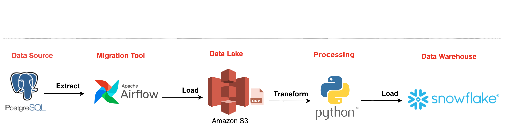

## Setup an Airflow project on your local

1. Install Astro CLI using brew install astro
2. Initialize an Airflow project using astro dev init
3. Start your local Airflow environment using astro dev start

For detailed instructions, see [Astro CLI docs](https://docs.astronomer.io/astro/cli/overview).

## Project Overview

## Data stack:

- **Source database:** PostgreSQL
- **Target database:** Snowflake
- **Sync Frequency:** Inter-day (Batch)
- **Source tables:** customer, customer_address, customer_payment
- **Target table:** customer
- **Sync type:** Full sync followed by daily incremental syncs based on a timestamp column in source, updated_at
- **SCD Type:** Target table is a SCD Type 2

### Example pipeline - etl_db_to_db.py

Setup SQL in: `include/setup/`

DAG sql in: `include/etl_db_to_db/`

To see how to export your connections in URI format see, [Import and export Airflow objects using Astro CLI](https://docs.astronomer.io/astro/import-export-connections-variables#using-the-astro-cli-local-environments-only).
